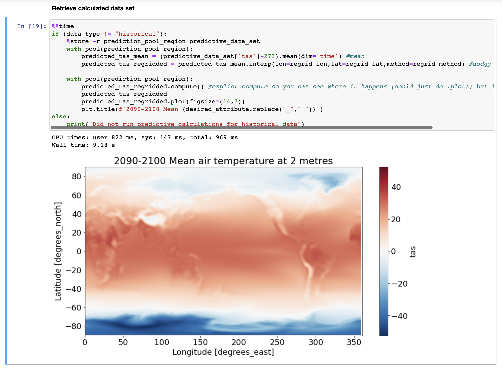

# Distributed Compute on AWS with Cross Regional Dask

The packaged solution presented in this repository proposes a distributed computing solution which uses AWS's global network to not only scale on storage, but minimise data replication across the globe. Extending the capabilities of [Dask](https://www.dask.org/) in combination with libraries such as [dask-worker-pools](https://github.com/gjoseph92/dask-worker-pools). No longer are data scientist's having to migrate petabytes of data interregionally, but instead now have capability in querying/interacting with data at the edge.

## Architecture


This architecture leverages the [Dask framework](https://docs.dask.org) deployed across multiple AWS regions. Dask is a widely adopted data science framework granting users the capabilities of running complex calculations on large datasets, however now with the added benefit of minimising the movement of data through this sample. No longer are users having to migrate mass public S3 datasets to their location, but rather leveraging [Lustre’s ability to integrate seamlessly with public S3 datasets](https://aws.amazon.com/blogs/aws/enhanced-amazon-s3-integration-for-amazon-fsx-for-lustre).

Through the use of Dask & Lustre, data scientists can perform high I/O intensive workloads on data sparsely located across the globe. Instead of having data replicated from its source region to the user's region, we can deploy a compute solution that strategically positions its workers as close as possible to the dataset. This sample loads in two default datasets which you can **customise in bin/variables.ts**
One is in _us-east-1_ region and the other in _us-west-2_. Which aligns in our architecture as Region B & C.

The user interacting with these datasets is located in _eu-west-2_ region, or as illustrated in the diagram, Region A. Each region communicates to each other via the Amazon Transit Gateway.

The bigger picture is that the solution has at the helm a client region containing all the necessary resources for the user to connect into a notebook. That notebook in turn is able to command a scheduler and query a catalogue listing the datasets currently loaded on each of the worker regions.

Each of the worker regions are copies of themselves, containing Dask workers that connect into the scheduler and have a local Lustre filesystem which syncs to public datasets. The pattern of these regions is generic to allow the user to scale out, include more regions, or scale in, using fewer regions.

## Installation

In order to install all the relevant libraries, execute the following code from the root of the project.

```bash
npm install
```

## Deployment

Once all libraries have been installed, you can proceed in deploying all stacks with the following command.

```bash
cdk deploy --all
```

Or if you'd like to skip all manual approvals run:

```bash
cdk deploy --all --require-approval never
```

> Stack can take some time to deploy. Expect more than 1 $\frac{1}{2}$ hours to deploy.

## CDK Deployment Readiness

The sample takes advantage of [AWS Cloud Development Kit (CDK)](https://docs.aws.amazon.com/cdk/index.html) to define infrastructure as code. This section focuses on some of the tools and configurations required in order to successfully deploy the CDK. It highlights steps such as ensuring the deployment machine has the correct version of CDK, bootstrapping each region, quota limits to be able to deploy the resources, and a need for docker to deploy the image, otherwise an alternative if Docker is not possible.

### CDK Version

Ensure that the cdk version you are using from your cli is up to date or more **strictly >= 21.0**. You can update your cli by running the below command for all users:

```bash
sudo npm i -g aws-cdk
cdk --version
```

### CDK Bootstrapping Regions

Make sure you bootstrap each region you plan on deploying to. Information on regions configured are stored in the **bin/variables.ts**. By default we deploy to eu-west-2, us-east-1, and us-west-2. You can change these and/or add more if you please.

```bash
cdk bootstrap <AWS Account Number>/<Region-A> <AWS Account Number>/<Region-B> ...
```

### Account Quotas

You’ll need to ensure you have sufficient quota in each of the regions for the below, otherwise the cdk might fail to deploy:

- Worker regions require a minimum of 50 vCPUs Running On-Demand Standard (A, C, D, H, I, M, R, T, Z) instances in order to reasonably deploy and scale up to 30 workers. More will allow it to scale higher.
- All regions will require at least 2 Elastic Ips to assume for the public subnets deployed in each region.

### Docker On Deployment Machine

In order to deploy the public Dask image and have inspector scan it for vulnerabilities, the deployment machine will have to have docker running in the background. This is because the CDK will attempt to build the image and upload it to ECR, to which the container will then use. If the machine is not able to have docker running you can pull directly from the public image on Dockerhub with the below code changes in the client-region-stack.ts and worker-region-stack.ts.

```javascript
image: ContainerImage.fromRegistry('daskdev/dask:2022.10.0'),
// image: ContainerImage.fromDockerImageAsset(
//   new DockerImageAsset(this, 'Worker Image Repo', {
//   directory: path.join(__dirname, 'DaskImage'),
//   platform: Platform.LINUX_AMD64,
//   })
// ),
```

## Testing

Once all resources have successfully deployed, a Sagemaker Notebook in the _eu-west-2_ should be available. On that notebook should be a series of files; the one of interest is the **ux_notebook.ipynb**. The notebook contains details on it's purpose, however feel free to use the below inputs for a first run.

> Q: Data type<br />
> A: both

> Q: Which of the above would you like to select?<br />
> A: temperature

> Q: Below are the start and end dates<br />
> A: Start Date 1st Jan 2022, End Date 28th Nov 2022

> Q: Select all that you would like to be included in the dataset<br />
> A: ScenarioMIP, CMIP

Any parameters not mentioned above, keep them as default and you should see after running the notebook a graph similiar to the below.



## Security

See [CONTRIBUTING](CONTRIBUTING.md#security-issue-notifications) for more information.

## License

This library is licensed under the MIT-0 License. See the LICENSE file.
